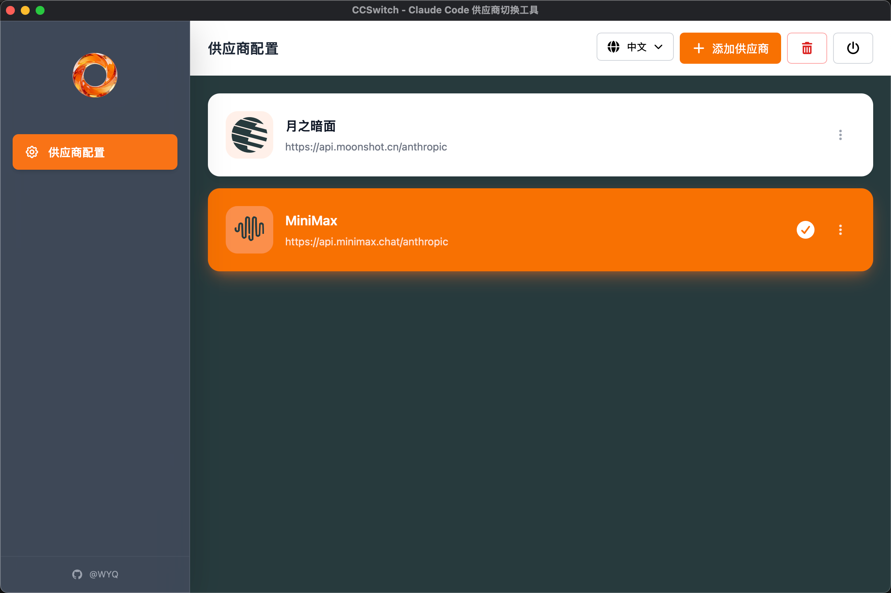

# CCSwitch - Claude Code Provider Switcher

[English](#english) | [中文](#中文)

---

<a name="english"></a>

## 🌟 English

### Overview

CCSwitch is a desktop application built with Tauri + Vue 3 for managing and switching Claude Code API provider configurations. It provides a modern, user-friendly interface to manage multiple API providers and switch between them with a single click.

### ✨ Features

- 🔄 **One-Click Provider Switching** - Instantly switch between different API providers
- 📝 **Built-in Templates** - Pre-configured templates for popular providers (Claude, Zhipu AI, Moonshot, DeepSeek, Qiniu, MiniMax, Qwen, OpenRouter, Gemini)
- 🎨 **Modern UI** - Beautiful, intuitive interface with glass morphism design
- 🌍 **Multi-language Support** - English and Simplified Chinese
- 💾 **Configuration Management** - Save and manage multiple provider configurations
- 🖥️ **Cross-Platform** - Supports macOS and Windows

### 📸 Screenshots




### 🛠️ Tech Stack

- **Frontend**: Vue 3 + TypeScript + Composition API
- **UI Framework**: Tailwind CSS
- **Desktop Framework**: Tauri 2.x
- **State Management**: Pinia
- **Router**: Vue Router 4
- **Internationalization**: Vue I18n

---

## 🚀 Getting Started

### Prerequisites

Before you begin, ensure you have the following installed:

1. **Node.js** (v18 or higher)
   - Download from [nodejs.org](https://nodejs.org/)
   - Verify installation: `node --version`

2. **Rust** (v1.70 or higher)
   - Install via [rustup](https://rustup.rs/)
   - Verify installation: `rustc --version`

3. **Platform-specific tools**:
   - **macOS**: Xcode Command Line Tools
     ```bash
     xcode-select --install
     ```
   - **Windows**: Microsoft Visual Studio C++ Build Tools
     - Download from [Visual Studio](https://visualstudio.microsoft.com/downloads/)
     - Install "Desktop development with C++" workload

### Step-by-Step Installation

#### Step 1: Clone the Repository

```bash
git clone https://github.com/wyq09/ccswitch.git
cd ccswitch/ccswitch-app
```

#### Step 2: Install Dependencies

```bash
npm install
```

This will install all required Node.js packages.

#### Step 3: Run Development Server

```bash
npm run tauri dev
```

The application will launch in development mode with hot-reload enabled.

---

## 📦 Building for Production

### macOS

#### Build Universal Binary (Intel + Apple Silicon)

```bash
npm run tauri build -- --target universal-apple-darwin
```

**Output location**: `src-tauri/target/universal-apple-darwin/release/bundle/`

**Available formats**:
- `.app` - Application bundle
- `.dmg` - Disk image installer

#### Build for Specific Architecture

**Apple Silicon (M1/M2/M3)**:
```bash
npm run tauri build -- --target aarch64-apple-darwin
```

**Intel**:
```bash
npm run tauri build -- --target x86_64-apple-darwin
```

### Windows

#### Build for Windows 64-bit

```bash
npm run tauri build -- --target x86_64-pc-windows-msvc
```

**Output location**: `src-tauri/target/x86_64-pc-windows-msvc/release/bundle/`

**Available formats**:
- `.exe` - Executable installer
- `.msi` - Windows Installer package

#### Build for Windows 32-bit

```bash
npm run tauri build -- --target i686-pc-windows-msvc
```

---

## 📖 Usage Guide

### Adding a Provider

1. Click the **"Add Provider"** button in the top-right corner
2. Choose a template or fill in custom configuration:
   - **Provider Name**: A friendly name for your provider
   - **API Key**: Your API key from the provider
   - **API Endpoint**: The base URL for the API
   - **Models**: Configure model mappings (Opus, Sonnet, Haiku)
3. Click **"Save"** to add the provider

### Switching Providers

1. Click on any provider card in the list
2. The active provider will be highlighted with an orange background
3. **Important**: Restart Claude Code for changes to take effect

### Editing a Provider

1. Click the menu icon (⋮) on the provider card
2. Modify the configuration as needed
3. Click **"Save"** to update

### Deleting a Provider

1. Open the provider edit page
2. Click the **"Delete"** button
3. Confirm the deletion

### Changing Language

Click the globe icon (🌐) in the top-right corner and select your preferred language.

---

## 📂 Configuration Files

### Application Data

- **macOS**: `~/Library/Application Support/com.yiqunwu.ccswitch/`
- **Windows**: `%APPDATA%\com.yiqunwu.ccswitch\`

### Claude Configuration

- **Location**: `~/.claude/settings.json`
- **Modified by**: CCSwitch automatically updates this file when switching providers

---

## 🔧 Development Scripts

| Command | Description |
|---------|-------------|
| `npm install` | Install dependencies |
| `npm run dev` | Start Vite dev server (frontend only) |
| `npm run tauri dev` | Start Tauri development mode with hot-reload |
| `npm run build` | Build frontend for production |
| `npm run tauri build` | Build complete application for current platform |
| `npm run preview` | Preview production build |

---

## 🤝 Contributing

Contributions are welcome! Please feel free to submit a Pull Request.

1. Fork the repository
2. Create your feature branch (`git checkout -b feature/AmazingFeature`)
3. Commit your changes (`git commit -m 'Add some AmazingFeature'`)
4. Push to the branch (`git push origin feature/AmazingFeature`)
5. Open a Pull Request

---

## 📝 License

This project is licensed under the MIT License - see the [LICENSE](LICENSE) file for details.

---

## 👨‍💻 Author

**@WYQ**
- GitHub: [@wyq09](https://github.com/wyq09)
- Project: [CCSwitch](https://github.com/wyq09/ccswitch)

---

## ⚠️ Important Notes

- **Restart Required**: After switching providers, you must restart Claude Code for the changes to take effect
- **Backup**: It's recommended to backup your `~/.claude/settings.json` before using CCSwitch
- **API Keys**: Keep your API keys secure and never share them publicly

---

## 🐛 Troubleshooting

### Common Issues

**1. "Command not found: tauri"**
- Solution: Make sure Rust is installed and in your PATH

**2. Build fails on macOS**
- Solution: Install Xcode Command Line Tools: `xcode-select --install`

**3. Build fails on Windows**
- Solution: Install Visual Studio C++ Build Tools

**4. Provider switch doesn't work**
- Solution: Make sure to restart Claude Code after switching

For more issues, please check [GitHub Issues](https://github.com/wyq09/ccswitch/issues).

---

<a name="中文"></a>

## 🌟 中文

### 项目简介

CCSwitch 是一个基于 Tauri + Vue 3 构建的桌面应用程序，用于管理和切换 Claude Code 的 API 供应商配置。它提供了现代化、用户友好的界面，让你可以管理多个 API 供应商并一键切换。

### ✨ 功能特性

- 🔄 **一键切换供应商** - 快速在不同 API 供应商之间切换
- 📝 **内置模板** - 预配置的热门供应商模板（Claude、智谱 AI、月之暗面、DeepSeek、七牛云、MiniMax、通义千问、OpenRouter、Gemini）
- 🎨 **现代化 UI** - 美观直观的玻璃态设计界面
- 🌍 **多语言支持** - 支持英文和简体中文
- 💾 **配置管理** - 保存和管理多个供应商配置
- 🖥️ **跨平台** - 支持 macOS 和 Windows

### 📸 截图


### 🛠️ 技术栈

- **前端**: Vue 3 + TypeScript + Composition API
- **UI 框架**: Tailwind CSS
- **桌面框架**: Tauri 2.x
- **状态管理**: Pinia
- **路由**: Vue Router 4
- **国际化**: Vue I18n

---

## 🚀 快速开始

### 环境要求

在开始之前，请确保已安装以下软件：

1. **Node.js**（v18 或更高版本）
   - 从 [nodejs.org](https://nodejs.org/) 下载
   - 验证安装：`node --version`

2. **Rust**（v1.70 或更高版本）
   - 通过 [rustup](https://rustup.rs/) 安装
   - 验证安装：`rustc --version`

3. **平台特定工具**：
   - **macOS**: Xcode 命令行工具
     ```bash
     xcode-select --install
     ```
   - **Windows**: Microsoft Visual Studio C++ 生成工具
     - 从 [Visual Studio](https://visualstudio.microsoft.com/downloads/) 下载
     - 安装"使用 C++ 的桌面开发"工作负载

### 分步安装指南

#### 步骤 1：克隆仓库

```bash
git clone https://github.com/wyq09/ccswitch.git
cd ccswitch/ccswitch-app
```

#### 步骤 2：安装依赖

```bash
npm install
```

这将安装所有必需的 Node.js 包。

#### 步骤 3：运行开发服务器

```bash
npm run tauri dev
```

应用程序将以开发模式启动，并启用热重载功能。

---

## 📦 生产环境构建

### macOS

#### 构建通用二进制文件（Intel + Apple Silicon）

```bash
npm run tauri build -- --target universal-apple-darwin
```

**输出位置**：`src-tauri/target/universal-apple-darwin/release/bundle/`

**可用格式**：
- `.app` - 应用程序包
- `.dmg` - 磁盘映像安装程序

#### 构建特定架构

**Apple Silicon（M1/M2/M3）**：
```bash
npm run tauri build -- --target aarch64-apple-darwin
```

**Intel**：
```bash
npm run tauri build -- --target x86_64-apple-darwin
```

### Windows

#### 构建 Windows 64 位版本

```bash
npm run tauri build -- --target x86_64-pc-windows-msvc
```

**输出位置**：`src-tauri/target/x86_64-pc-windows-msvc/release/bundle/`

**可用格式**：
- `.exe` - 可执行安装程序
- `.msi` - Windows 安装程序包

#### 构建 Windows 32 位版本

```bash
npm run tauri build -- --target i686-pc-windows-msvc
```

---

## 📖 使用指南

### 添加供应商

1. 点击右上角的**"添加供应商"**按钮
2. 选择模板或填写自定义配置：
   - **供应商名称**：为供应商设置一个友好的名称
   - **API 密钥**：从供应商处获取的 API 密钥
   - **API 端点**：API 的基础 URL
   - **模型配置**：配置模型映射（Opus、Sonnet、Haiku）
3. 点击**"保存"**添加供应商

### 切换供应商

1. 点击列表中的任意供应商卡片
2. 激活的供应商将以橙色背景高亮显示
3. **重要**：重启 Claude Code 使更改生效

### 编辑供应商

1. 点击供应商卡片右侧的菜单图标（⋮）
2. 根据需要修改配置
3. 点击**"保存"**更新配置

### 删除供应商

1. 打开供应商编辑页面
2. 点击**"删除"**按钮
3. 确认删除操作

### 切换语言

点击右上角的地球图标（🌐），选择你喜欢的语言。

---

## 📂 配置文件

### 应用数据

- **macOS**：`~/Library/Application Support/com.yiqunwu.ccswitch/`
- **Windows**：`%APPDATA%\com.yiqunwu.ccswitch\`

### Claude 配置

- **位置**：`~/.claude/settings.json`
- **修改方式**：CCSwitch 在切换供应商时会自动更新此文件

---

## 🔧 开发脚本

| 命令 | 说明 |
|------|------|
| `npm install` | 安装依赖 |
| `npm run dev` | 启动 Vite 开发服务器（仅前端） |
| `npm run tauri dev` | 启动 Tauri 开发模式（带热重载） |
| `npm run build` | 构建生产环境前端 |
| `npm run tauri build` | 为当前平台构建完整应用程序 |
| `npm run preview` | 预览生产构建 |

---

## 🤝 贡献

欢迎贡献！请随时提交 Pull Request。

1. Fork 本仓库
2. 创建你的特性分支（`git checkout -b feature/AmazingFeature`）
3. 提交你的更改（`git commit -m 'Add some AmazingFeature'`）
4. 推送到分支（`git push origin feature/AmazingFeature`）
5. 打开一个 Pull Request

---

## 📝 许可证

本项目采用 MIT 许可证 - 详见 [LICENSE](LICENSE) 文件。

---

## 👨‍💻 作者

**@WYQ**
- GitHub：[@wyq09](https://github.com/wyq09)
- 项目：[CCSwitch](https://github.com/wyq09/ccswitch)

---

## ⚠️ 重要提示

- **需要重启**：切换供应商后，必须重启 Claude Code 才能使更改生效
- **备份**：建议在使用 CCSwitch 之前备份你的 `~/.claude/settings.json` 文件
- **API 密钥**：请妥善保管你的 API 密钥，切勿公开分享

---

## 🐛 故障排除

### 常见问题

**1. "Command not found: tauri"**
- 解决方案：确保已安装 Rust 并已添加到 PATH

**2. macOS 构建失败**
- 解决方案：安装 Xcode 命令行工具：`xcode-select --install`

**3. Windows 构建失败**
- 解决方案：安装 Visual Studio C++ 生成工具

**4. 供应商切换不生效**
- 解决方案：确保在切换后重启 Claude Code

如有更多问题，请查看 [GitHub Issues](https://github.com/wyq09/ccswitch/issues)。

---

## 🙏 致谢

感谢所有为本项目做出贡献的开发者！

---

**⭐ 如果这个项目对你有帮助，请给它一个 Star！**
